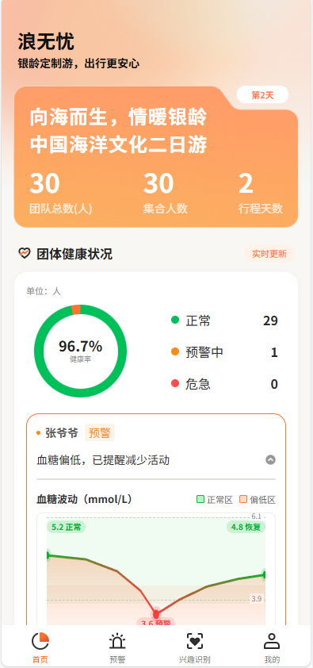
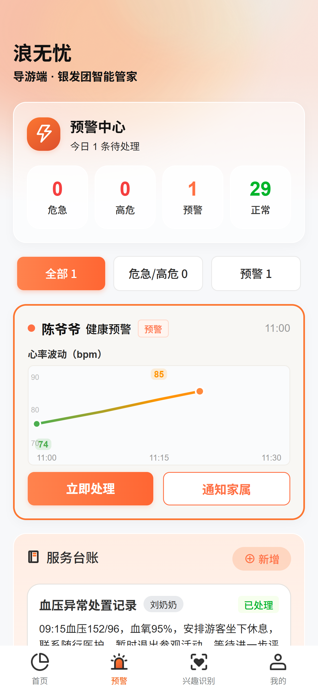

# 浪无忧 —— 导游端 · 银发团智能管家

> 面向老年旅行团导游的健康监测与管理应用，实时掌握团员体征数据，异常预警及时播报，让银发团的每一次出行更安心。

## 项目简介

浪无忧（导游端）是一款基于 **uni-app** 开发的移动应用，围绕"老年团出游安全"场景，为导游提供：

- 团员健康体征实时监测（心率、血压、血氧、血糖等）

- 异常情况分级预警与语音播报

- 预警处置流程与服务台账记录

- 游客兴趣大数据分析与分享抽取

- 血糖异常恢复方案跟踪

## 核心功能

| 页面     | 功能说明                                                                                   |
| ------ | -------------------------------------------------------------------------------------- |
| 首页     | 团体健康状况概览、团员血压/血糖异常提醒（如张奶奶血压偏高）、今日行程、服务台账、血糖波动曲线（5.2 → 3.6 → 4.8，含"补糖凝胶"处置标注）           |
| 预警中心   | 危急/高危/预警/正常四级统计、分级筛选、预警事件卡片（心率波动动态曲线 74 → 85 → 76，点击"立即查看"后 5 秒自动绘制下降段）、语音播报、服务台账、团员名单 |
| 兴趣识别   | 大数据分析动态效果（分析中 → 输出结果：历史 15 次 / 非遗 23 次）、游客分享随机抽取动画                                     |
| 血糖恢复方案 | 血糖恢复进度条动画、血糖波动趋势图（干预前后对比）                                                              |
| 我的     | 个人中心                                                                                   |

**特色交互**

- SVG 路径描边动画：心率/血糖曲线动态绘制，圆点与线条同步滑动

- 语音播报：基于 Web Speech API，弹窗打开自动播报预警内容

- 吉祥物动态形象：浮动动画，点击触发播报

- 预警弹窗：进入页面即弹出，点击"立即查看"关闭并触发曲线更新

## 技术栈

- 框架：uni-app（HBuilderX）

- 语言：Vue 2 + JavaScript

- 样式：SCSS（rpx 响应式布局）

- 动画：SVG stroke-dasharray / CSS transition / keyframes

- 语音：Web Speech API（H5 端）

## 项目截图

<!-- ==================== 截图占位区 ====================
  使用说明：
  1. 在项目根目录新建 screenshots/ 文件夹（如不存在）
  2. 将截图放入该文件夹
  3. 取消下方对应图片的注释，将文件名替换为实际截图名称
  4. 如需多张截图，可复制一行后修改描述与文件名

  示例：
  ### 首页
  

  ### 预警中心
  
========================================================= -->

## 目录结构

```
├── pages/                    # 页面
│   ├── index/                # 首页
│   ├── warning/              # 预警中心
│   ├── interest/             # 兴趣识别 / 大数据分析
│   ├── sugar/                # 血糖恢复方案
│   └── my/                   # 我的
├── components/
│   └── RiskWarningModal/     # 预警弹窗组件
├── static/                   # 静态资源（图标 / 图片）
├── pages.json                # 页面路由与 tabBar 配置
├── manifest.json             # 应用配置
├── main.js                   # 应用入口
├── App.vue                   # 根组件
└── uni.scss                  # 全局样式变量
```

## 运行方式

1. 使用 [HBuilderX](https://www.dcloud.io/hbuilderx.html) 导入本项目
2. 菜单栏选择：运行 → 运行到浏览器 → Chrome（H5 端）
3. 如需编译为其他平台（微信小程序 / App），在 manifest.json 中配置对应 appid 后运行

## 说明

- 当前版本以 H5 端演示为主，语音播报依赖浏览器 Web Speech API 支持

- 页面中的健康数据均为演示数据

